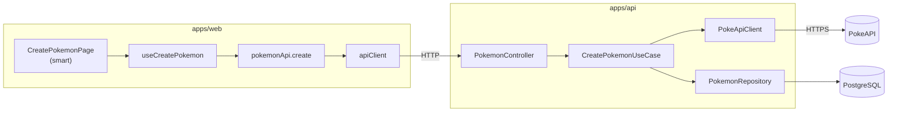

# Guía del desarrollador

> Documento para quien va a **revisar, mantener o extender** el código del reto Pokemon. Cubre arquitectura, convenciones de escritura, contratos HTTP y cómo levantar el entorno.

## Índice

1. [Visión general](#visión-general)
2. [Cómo levantar la aplicación](#cómo-levantar-la-aplicación)
3. [Estructura del repositorio](#estructura-del-repositorio)
4. [Arquitectura](#arquitectura)
5. [Backend (`apps/api`)](#backend-appsapi)
6. [Frontend (`apps/web`)](#frontend-appsweb)
7. [Contrato HTTP y respuesta estandarizada](#contrato-http-y-respuesta-estandarizada)
8. [Guía de estilo de código](#guía-de-estilo-de-código)
9. [Cómo revisar el código (ruta sugerida)](#cómo-revisar-el-código-ruta-sugerida)
10. [Tests y calidad](#tests-y-calidad)
11. [Solución de problemas](#solución-de-problemas)
12. [Variables de entorno](#variables-de-entorno)
13. [Documentación relacionada](#documentación-relacionada)

---

## Visión general

Monorepo con dos aplicaciones independientes:

| App | Stack | Rol |
|-----|-------|-----|
| `apps/api` | NestJS 10, TypeORM, PostgreSQL 16 | Único punto que habla con PokeAPI y persiste en BD |
| `apps/web` | React 19, Vite 8, TanStack Query | Dashboard: lista (`GET /pokemon`) y creación (`POST /pokemon`) |

Orquestación con **Docker Compose**. No hay workspaces npm ni paquetes compartidos (`packages/`): cada app tiene su propio `package.json`.

Principios transversales:

- **TypeScript strict** en ambas apps.
- **Separación de capas**: lógica de negocio fuera de controllers y componentes visuales.
- **Tests unitarios** con mocks en los límites (ports en backend, props/fetch en frontend).
- **Tests E2E (Playwright)** contra el stack Docker en `apps/web/e2e/` — ver [Tests y calidad](#tests-y-calidad).
- **Sin secretos en repo**: `.env` gitignored, `.env.example` commiteado.

---

## Cómo levantar la aplicación

### Opción recomendada: Docker Compose

Requisitos: Docker Desktop (o Docker Engine + Compose v2).

```bash
# Desde la raíz del repo
cp .env.example .env
docker compose up --build
```

| Servicio | URL |
|----------|-----|
| Dashboard web | http://localhost |
| API REST | http://localhost:3000 |
| Swagger UI | http://localhost:3000/api/docs |
| OpenAPI JSON | http://localhost:3000/api/docs-json |
| PostgreSQL | localhost:5432 (solo desde fuera del compose) |

Comandos útiles:

```bash
docker compose up --build -d    # segundo plano
docker compose logs -f api      # logs de un servicio
docker compose down             # parar y quitar contenedores
```

### Desarrollo local (hot reload)

Útil cuando estás tocando código con frecuencia.

**1. Base de datos** (puede ser solo el servicio `db` de compose):

```bash
docker compose up db
```

**2. API** (terminal 2):

```bash
cd apps/api
npm install
# DATABASE_URL apuntando a localhost:5432 (ver .env.example)
npm run start:dev
```

**3. Web** (terminal 3):

```bash
cd apps/web
npm install
npm run dev
```

- Frontend: http://localhost:5173
- Asegurate de tener `VITE_API_BASE_URL=http://localhost:3000` en `.env` de la raíz o en un `.env` local de Vite.

### Verificación

```bash
curl -X POST http://localhost:3000/pokemon \
  -H "Content-Type: application/json" \
  -d '{"name":"pikachu"}'
```

Respuesta esperada: `201` con envelope (ver sección [Contrato HTTP](#contrato-http-y-respuesta-estandarizada)).

---

## Estructura del repositorio

```
reto/
├── apps/
│   ├── api/                    # NestJS — hexagonal ligera
│   │   └── src/
│   │       ├── main.ts
│   │       ├── app.module.ts
│   │       ├── shared/         # Filtros, interceptors, errores transversales
│   │       └── modules/
│   │           └── pokemon/    # Único módulo de negocio (v1)
│   └── web/                    # React — feature-based
│       └── src/
│           ├── app/            # Bootstrap, router, providers
│           ├── pages/          # Smart components (orquestación)
│           ├── features/       # Lógica por dominio UI
│           └── shared/         # UI atoms + api-client
├── docs/
│   ├── adr/                    # Decisiones arquitectónicas (vinculantes)
│   ├── infra/                  # C4, flujos, modelo de datos
│   └── guia-desarrollador.md   # ← este documento
├── openspec/                   # Especificaciones y historial de cambios
├── docker-compose.yml
├── .env.example
└── README.md
```

---

## Arquitectura

### Flujos de datos

**Listado (GET /pokemon)**

```
Usuario
  → web (:80 / :5173)
    → api GET /pokemon (:3000)
      → PostgreSQL (:5432)
```

**Creación (POST /pokemon)**

```
Usuario
  → web (:80 / :5173)
    → api POST /pokemon (:3000)
      → PokeAPI (internet)
      → PostgreSQL (:5432)
```

El browser **nunca** llama a PokeAPI. Toda integración externa pasa por la API.

### Diagrama de capas (conceptual)



### Mapeo backend ↔ frontend

| Backend | Frontend | Responsabilidad |
|---------|----------|-----------------|
| `PokemonController` | `CreatePokemonPage` | Punto de entrada HTTP / UI |
| `CreatePokemonUseCase` | `useCreatePokemon` | Orquestación del flujo |
| `PokeApiPort` / `PokemonRepositoryPort` | `pokemonApi` + `apiClient` | Adaptadores a sistemas externos |
| Errores de dominio → `HttpExceptionFilter` | `ApiError` + `ErrorMessage` | Traducción a HTTP / mensaje usuario |
| `TransformInterceptor` | unwrap de `data` en `apiClient` | Respuesta estandarizada |

---

## Backend (`apps/api`)

### Patrón: monolito modular + hexagonal ligera

Un solo módulo feature (`pokemon`) con tres capas internas:

```
modules/pokemon/
├── domain/           # Entidades + ports (interfaces). Sin NestJS, sin TypeORM.
├── application/      # Use cases. Solo dependen de domain/.
└── infrastructure/   # HTTP, PokeAPI, persistencia. Implementan los ports.
```

#### Reglas de dependencia

| Capa | Puede importar |
|------|----------------|
| `domain/` | Solo TypeScript puro |
| `application/` | `domain/` |
| `infrastructure/` | `domain/`, `application/`, frameworks |
| `shared/` | Utilidades transversales (filtros, interceptors, errores genéricos) |

**Prohibido:** que `CreatePokemonUseCase` importe TypeORM, Axios o decoradores NestJS.

#### Inyección de ports

Los adapters se registran con tokens simbólicos en `pokemon.module.ts`:

- `POKE_API_PORT` → `PokeApiClient`
- `POKEMON_REPOSITORY_PORT` → `PokemonRepository`

El use case recibe las **interfaces** (`PokeApiPort`, `PokemonRepositoryPort`), no las clases concretas.

#### Flujo de los endpoints

**GET /pokemon**

```
GET /pokemon
  → ListPokemonUseCase.execute()
    → repository.findAll()  // orden savedAt DESC
  → PokemonResponseDto[] (mapeo a JSON)
  → TransformInterceptor (envelope de éxito)
```

**POST /pokemon**

```
POST /pokemon
  → CreatePokemonDto (validación class-validator)
  → CreatePokemonUseCase.execute({ name })
    → pokeApi.findByName(name)
    → new Pokemon(...)
    → repository.save(pokemon)
  → PokemonResponseDto (mapeo a JSON, incluye spriteUrl)
  → TransformInterceptor (envelope de éxito)
```

Campos por ítem: `id`, `name`, `height`, `weight`, `baseExperience`, `savedAt`, `spriteUrl` (string o `null`), `types` (array de nombres de tipo).

#### Errores de dominio

Clases en `shared/errors/domain.errors.ts`:

| Error | HTTP | Cuándo |
|-------|------|--------|
| `PokemonNotFoundError` | 404 | PokeAPI devuelve 404 |
| `ExternalApiUnavailableError` | 502 | Timeout, 5xx, red caída |
| `InvalidExternalDataError` | 502 | Respuesta PokeAPI incompleta |
| `PersistenceError` | 500 | Fallo al guardar en BD |

El `HttpExceptionFilter` global traduce estos errores (y `HttpException` de Nest) al envelope de error.

#### Transversal en `shared/`

| Archivo | Rol |
|---------|-----|
| `transform.interceptor.ts` | Envuelve respuestas exitosas en `{ success, statusCode, data, timestamp }` |
| `http-exception.filter.ts` | Envuelve errores en `{ success: false, message, error, ... }` |
| `domain/api-response.interface.ts` | Tipo del envelope |

Swagger en `/api/docs` documenta el envelope explícitamente.

---

## Frontend (`apps/web`)

### Patrón: feature-based + smart/dumb

```
src/
├── app/              # App.tsx, router, QueryClientProvider
├── pages/            # Smart: conectan hooks + componentes
├── features/pokemon/
│   ├── api/          # Adapter HTTP del feature
│   ├── hooks/        # TanStack Query (useMutation)
│   ├── components/   # Dumb: solo props, sin fetch ni Query
│   ├── schema/       # Zod para formulario
│   └── types/        # Tipos del dominio UI
└── shared/
    ├── api/          # apiClient (fetch + unwrap envelope)
    └── ui/           # Atoms: Button, Input, ErrorMessage
```

#### Reglas de capas

| Capa | Responsabilidad | No debe |
|------|-----------------|---------|
| `shared/ui/` | Componentes visuales reutilizables | Importar TanStack Query, `fetch`, lógica de negocio |
| `features/*/components/` | UI del feature (dumb) | Llamar API directamente |
| `features/*/hooks/` | Server state (`useMutation`) | Renderizar JSX complejo |
| `pages/` | Orquestar estado de pantalla | Contener lógica HTTP cruda |
| `shared/api/` | Cliente HTTP base | Conocer tipos de pokemon |

**Regla de oro:** si un componente en `components/` importa `useQuery`/`useMutation`, probablemente debería ser smart y vivir en `pages/`.

#### Flujo de la pantalla principal

```
CreatePokemonPage
  → usePokemonList (useQuery)          # GET /pokemon al montar
    → pokemonApi.list()
      → apiGet('/pokemon')
  → useCreatePokemon (mutate)
    → pokemonApi.create(name)
      → apiPost('/pokemon', { name })
    → onSuccess: invalidateQueries(POKEMON_LIST_QUERY_KEY)
  → buildStats(list)                   # Total, Tipos, Último desde lista API
  → PokemonForm / PokemonResult / PokemonStats / PokemonList
  → selectedId (estado local)          # clic en lista → detalle
```

**Total** y **Último** se derivan de `usePokemonList` (persistido en PostgreSQL). Tras crear, la lista se refresca con `invalidateQueries`; no hay estado de sesión separado. Ver también [README — Ejemplos API](/README.md#ejemplos-api) para JSON de referencia.

---

## Contrato HTTP y respuesta estandarizada

Todas las respuestas de la API (excepto assets de Swagger) siguen el **mismo formato**.

### Listado (`200 OK`) — `GET /pokemon`

```bash
curl http://localhost:3000/pokemon
```

```json
{
  "success": true,
  "statusCode": 200,
  "data": [
    {
      "id": 25,
      "name": "pikachu",
      "height": 4,
      "weight": 60,
      "baseExperience": 112,
      "savedAt": "2026-07-02T12:00:00.000Z",
      "spriteUrl": "https://raw.githubusercontent.com/PokeAPI/sprites/master/sprites/pokemon/25.png",
      "types": ["electric"]
    }
  ],
  "timestamp": "2026-07-02T12:00:00.000Z"
}
```

`data` es un array ordenado por `savedAt` descendente. Sin registros: `data` es `[]`.

### Creación (`201 Created`) — `POST /pokemon`

```bash
curl -X POST http://localhost:3000/pokemon \
  -H "Content-Type: application/json" \
  -d '{"name":"pikachu"}'
```

```json
{
  "success": true,
  "statusCode": 201,
  "data": {
    "id": 25,
    "name": "pikachu",
    "height": 4,
    "weight": 60,
    "baseExperience": 112,
    "savedAt": "2026-07-02T12:00:00.000Z",
    "spriteUrl": "https://raw.githubusercontent.com/PokeAPI/sprites/master/sprites/pokemon/25.png",
    "types": ["electric"]
  },
  "timestamp": "2026-07-02T12:00:00.000Z"
}
```

El controller devuelve solo el DTO del pokemon; el `TransformInterceptor` agrega el envelope.

**Upsert:** volver a crear un pokemon con el mismo `id` de PokeAPI actualiza `savedAt` y los campos desde PokeAPI; el contador **Total** en el dashboard no aumenta.

**Rate limit:** `POST /pokemon` — 20 solicitudes por minuto por IP (respuesta `429` con envelope de error estándar si se excede).

### Health check (`GET /health`)

```bash
curl -i http://localhost:3000/health
```

- **`200`** — proceso y PostgreSQL OK → `{"status":"ok"}` (JSON plano, sin envelope).
- **`503`** — PostgreSQL inalcanzable; Compose no marca `api` como healthy.

### Error (ejemplo `404`)

```json
{
  "success": false,
  "statusCode": 404,
  "data": null,
  "message": "Pokemon \"missingno\" not found",
  "error": "Not Found",
  "timestamp": "2026-07-02T12:00:00.000Z"
}
```

### Input aceptado

Cualquiera de las dos formas (el DTO normaliza internamente):

```json
{ "name": "pikachu" }
```

```json
{ "pokemon": "pikachu" }
```

### En el frontend

`api-client.ts` parsea el envelope, lanza `ApiError` si `success === false`, y devuelve solo `data` al resto de la app. Los componentes nunca ven el wrapper.

---

## Guía de estilo de código

### Principios generales

1. **Mínimo código que funcione.** No abstraigas hasta que haya un segundo caso de uso real.
2. **TypeScript estricto.** Sin `any` en dominio/application (backend) ni en tipos de feature (frontend). Usa `unknown` + narrowing en fronteras HTTP.
3. **Un archivo, una responsabilidad clara.** Nombres que digan qué hace el archivo (`create-pokemon.use-case.ts`, `pokemon.api.ts`).
4. **Errores tipados en backend.** Clases de dominio, no strings sueltos. En frontend, `ApiError` con `status` para mapear mensajes.
5. **Validación en el borde.** `class-validator` en DTOs (API), Zod en formularios (web). No confíes en input del cliente ni del body sin validar.
6. **Comentarios solo cuando aporten.** El código debe leerse solo; comenta reglas de negocio no obvias o trade-offs (`ponytail:` si hay un atajo deliberado).

### Convenciones de nombres

| Elemento | Convención | Ejemplo |
|----------|------------|---------|
| Use case | `{Verbo}{Entidad}UseCase` | `CreatePokemonUseCase` |
| Port (interface) | `{Entidad}{Rol}Port` | `PokemonRepositoryPort` |
| Token DI | `{NOMBRE}_PORT` | `POKE_API_PORT` |
| DTO HTTP | `{Accion}{Entidad}Dto` | `CreatePokemonDto` |
| Hook React | `use{Accion}{Entidad}` | `useCreatePokemon` |
| Adapter API (web) | `{entidad}.api.ts` | `pokemon.api.ts` |
| Test backend | `*.spec.ts` junto al fuente | `create-pokemon.use-case.spec.ts` |
| Test frontend | `*.test.ts(x)` junto al fuente | `PokemonForm.test.tsx` |

### Convención de tests

```
should <comportamiento> when <condición>
```

Ejemplos:

- `should throw PokemonNotFoundError when PokeAPI returns 404`
- `should disable submit button when loading is true`

### Backend: qué esperar al leer código

- **Controllers delgados:** validan DTO, delegan al use case, mapean respuesta. Sin lógica de negocio.
- **Use cases como clases plain:** constructor con ports, método `execute()`. Fáciles de instanciar en tests sin `TestingModule`.
- **Mappers explícitos** entre ORM entity ↔ dominio ↔ DTO cuando los tipos divergen.
- **Decoradores Swagger** en controller y DTOs para documentación viva.
- **Logs solo en errores 5xx** en el filter global; no loguear PII ni tokens.

### Frontend: qué esperar al leer código

- **Componentes funcionales** con props tipadas explícitas.
- **Tailwind** para estilos; dark theme con paleta slate en el dashboard.
- **Accesibilidad básica:** `aria-live` en zona de resultados, labels en inputs, botón móvil enlazado al form con `form={FORM_ID}`.
- **Mensajes de error en español** orientados al usuario (`mapHttpError` en `api-client.ts`).
- **React Hook Form + Zod** para validación client-side alineada al DTO del backend.

### Formateo y lint

| App | Herramientas | Comando |
|-----|--------------|---------|
| `apps/api` | ESLint + Prettier (Nest default) | `npm run lint`, `npm run format` |
| `apps/web` | oxlint | `npm run lint` |

Antes de abrir PR, ejecuta lint y tests en la app que tocaste.

### Lo que **no** vas a encontrar (por diseño)

- CQRS, event sourcing, microservicios
- Migraciones TypeORM (`synchronize: true` en el reto)
- Redux, RTK Query, Zustand
- Paquete compartido de tipos entre api y web
- Llamadas a PokeAPI desde el browser

---

## Cómo revisar el código (ruta sugerida)

Si revisás el código por primera vez, seguí este orden. Cada paso construye contexto para el siguiente.

### 1. Contrato y bootstrap

| Archivo | Por qué |
|---------|---------|
| `docker-compose.yml` | Servicios, puertos, env |
| `apps/api/src/main.ts` | CORS, pipes, filter, interceptor, Swagger |
| `apps/web/src/shared/api/api-client.ts` | Cómo el front consume el envelope |
| `apps/api/src/shared/interceptors/transform.interceptor.ts` | Cómo la API genera el envelope |

### 2. Flujo feliz end-to-end

| Archivo | Capa |
|---------|------|
| `apps/web/src/pages/CreatePokemonPage.tsx` | Smart UI |
| `apps/web/src/features/pokemon/hooks/useCreatePokemon.ts` | Mutación |
| `apps/web/src/features/pokemon/api/pokemon.api.ts` | Adapter HTTP |
| `apps/api/src/modules/pokemon/infrastructure/http/pokemon.controller.ts` | Entrada HTTP |
| `apps/api/src/modules/pokemon/application/create-pokemon.use-case.ts` | Orquestación |
| `apps/api/src/modules/pokemon/infrastructure/poke-api/poke-api.client.ts` | Integración PokeAPI |
| `apps/api/src/modules/pokemon/infrastructure/persistence/pokemon.repository.ts` | Persistencia |

Preguntas clave mientras leés:

- ¿Dónde se normaliza el nombre (`trim`, `toLowerCase`)?
- ¿Quién traduce un 404 de PokeAPI a respuesta HTTP?
- ¿El frontend asume JSON plano o envelope?

### 3. Manejo de errores

| Archivo | Rol |
|---------|-----|
| `apps/api/src/shared/errors/domain.errors.ts` | Errores de dominio |
| `apps/api/src/shared/filters/http-exception.filter.ts` | Dominio/HTTP → envelope error |
| `apps/web/src/shared/api/api-client.ts` | HTTP → `ApiError` |

### 4. Wiring e inversión de dependencias

| Archivo | Rol |
|---------|-----|
| `apps/api/src/modules/pokemon/pokemon.module.ts` | Registro de ports y use case |
| `apps/api/src/modules/pokemon/domain/ports/*.ts` | Contratos que mockean los tests |

### 5. Tests

Empezá por el use case (mayor densidad de lógica):

| Archivo | Qué valida |
|---------|------------|
| `create-pokemon.use-case.spec.ts` | Ramas de negocio |
| `poke-api.client.spec.ts` | Mapeo y errores externos |
| `pokemon.repository.spec.ts` | Persistencia |
| `pokemon.controller.spec.ts` | Delegación HTTP |
| `PokemonForm.test.tsx` | UI dumb con props |
| `useCreatePokemon.test.tsx` | Mutación y estados |
| `apps/web/e2e/*.spec.ts` | Aceptación fullstack con Playwright (requiere Docker) |

### Checklist de code review

- [ ] ¿La lógica nueva está en la capa correcta (no en controller ni en componente dumb)?
- [ ] ¿Los ports/interfaces permiten testear sin red ni BD?
- [ ] ¿Errores de dominio tipados en backend, no strings mágicos?
- [ ] ¿Respuestas API pasan por el envelope (interceptor/filter)?
- [ ] ¿Frontend unwrap `data` y no asume JSON legacy?
- [ ] ¿Tests nombrados `should ... when ...`?
- [ ] ¿Sin secretos, URLs hardcodeadas ni logs con datos sensibles?
- [ ] ¿Cobertura backend ≥ 85 % si tocaste lógica en `apps/api`?

---

## Tests y calidad

### Backend (Jest)

```bash
cd apps/api
npm run test          # unitarios
npm run test:cov      # con cobertura (umbral 85 % statements)
npm run test:watch    # modo watch
```

Umbrales en `jest.config.ts`:

- statements, functions, lines: **85 %**
- branches: **80 %**

Excluidos del cómputo: `main.ts`, `*.module.ts`, `*.orm-entity.ts` (solo wiring).

**Estrategia:** mock de ports en use case; mock de `HttpService` en PokeAPI client; mock de `Repository` en persistence.

### Frontend (Vitest)

```bash
cd apps/web
npm run test
npm run test:cov   # umbral ≥ 80 % (statements/branches/functions/lines)
npm run test:watch
```

CI y `test:cov` exigen ≥ 80 % en capas críticas (`src/`, excluye bootstrap y tests).

### E2E — aceptación con Playwright

Tests **end-to-end** en `apps/web/e2e/` que ejercitan el dashboard contra el entorno real (`http://localhost` vía Docker). Complementan Vitest/Jest; no los reemplazan.

**Prerrequisito:** stack levantado (`docker compose up --build -d` desde la raíz). Playwright corre en el **host**, no dentro del contenedor `web`.

```bash
# Primera vez (browser Chromium)
cd apps/web
npm install
npx playwright install chromium

# Ejecutar suite (7 archivos, 11 escenarios)
npm run test:e2e

# Depuración interactiva
npm run test:e2e:ui

# Ver reporte HTML tras un fallo
npx playwright show-report
```

Config: `apps/web/playwright.config.ts` — `baseURL: http://localhost`, `workers: 1` (BD compartida), timeout 60 s.

| Archivo | Qué valida |
|---------|------------|
| `e2e/dashboard.spec.ts` | Layout, crear pokemon, toast, stats, estado loading |
| `e2e/errors.spec.ts` | Validación formulario vacío, toast 404 |
| `e2e/list-error.spec.ts` | Fallo de `GET /pokemon` — banner, stats no disponibles, sin empty-state engañoso |
| `e2e/mobile.spec.ts` | Viewport móvil — submit sticky, crear pokemon |
| `e2e/list.spec.ts` | Lista registrados, selección de ítem |
| `e2e/persistence.spec.ts` | Tras reload, pokemon sigue en lista |
| `e2e/network.spec.ts` | El browser no llama a `pokeapi.co` |

Helper compartido: `e2e/helpers.ts` (`submitPokemon`).

Artefactos ignorados en git: `test-results/`, `playwright-report/` (`apps/web/.gitignore`).

Especificación: [delivery spec](/openspec/specs/delivery/spec.md) (End-to-End Acceptance Test Suite) y [frontend spec](/openspec/specs/frontend/spec.md) (escenarios Playwright).

### OpenSpec

Especificaciones canónicas en `openspec/specs/`. Historial de cambios archivado en `openspec/changes/archive/`.

```bash
# Si tenés openspec CLI instalado
openspec validate --specs
```

---

## Solución de problemas

### Docker / stack

| Síntoma | Qué probar |
|---------|------------|
| La UI no refleja cambios recientes | Reconstruir: `docker compose up --build -d` (Vite embebe `VITE_*` en build time) |
| `api` no pasa a healthy / web no arranca | `curl http://localhost:3000/health` — si `503`, PostgreSQL no está listo; `docker compose logs db api` |
| Puerto `5432` ocupado en el host | Otro Postgres local; parar el servicio o quitar el mapeo `5432:5432` en `docker-compose.yml` solo para dev |
| Datos viejos entre pruebas | Reset: `docker compose down -v && docker compose up --build -d` |

### Tests E2E (Playwright)

| Síntoma | Qué probar |
|---------|------------|
| `Executable doesn't exist` / browser missing | `cd apps/web && npx playwright install chromium` |
| Fallos intermitentes por datos en BD | Reset de volumen (arriba) o correr con `workers: 1` (ya configurado) |
| `list-error` no intercepta la API | El mock exige `http://localhost:3000/pokemon`; stack Docker por defecto. Si cambiás `VITE_API_BASE_URL`, reconstruí `web` y alineá la URL del test |
| E2E pasan pero la UI se ve “vieja” | Imagen `web` stale — `docker compose build web && docker compose up -d` |

### Desarrollo local (sin Docker)

- API: `DATABASE_URL` debe apuntar a Postgres accesible (`localhost:5432` con compose solo de `db`, o instancia local).
- Web: `VITE_API_BASE_URL=http://localhost:3000` en `.env` de la raíz o en `apps/web`.

---

## Variables de entorno

Archivo de referencia: `.env.example` en la raíz.

| Variable | Consumidor | Descripción |
|----------|------------|-------------|
| `POSTGRES_USER` | `db` | Usuario PostgreSQL |
| `POSTGRES_PASSWORD` | `db` | Contraseña PostgreSQL |
| `POSTGRES_DB` | `db` | Nombre de la base |
| `DATABASE_URL` | `api` | Connection string (host `db` en Docker, `localhost` en dev local) |
| `PORT` | `api` | Puerto HTTP (default 3000) |
| `POKEAPI_BASE_URL` | `api` | Base URL de PokeAPI |
| `VITE_API_BASE_URL` | `web` (build) | URL de la API vista desde el browser |

**Importante:** `VITE_*` se inyecta en **build time**. Si cambiás la URL en Docker, reconstruí la imagen web (`docker compose up --build`).

Nunca commitees `.env` con credenciales reales.

---

## Documentación relacionada

| Documento | Contenido |
|-----------|-----------|
| [README.md](/README.md) | Inicio rápido, ruta del evaluador y ejemplo curl |
| [Índice de documentación](/docs/README.md) | Mapa de `docs/` por audiencia |
| [Requisitos del reto](/docs/requirements/reto.md) | Historias US-01 – US-27 y contacto de entrega |
| [ADR-0001](/docs/adr/0001-monorepo-docker-compose.md) | Monorepo, Docker, puertos |
| [ADR-0002](/docs/adr/0002-backend-monolito-modular-hexagonal.md) | Backend hexagonal, tests, contrato |
| [ADR-0003](/docs/adr/0003-frontend-react-feature-based-tanstack-query.md) | Frontend, capas UI, TanStack Query |
| [ADR-0004](/docs/adr/0004-ci-github-actions.md) | CI (GitHub Actions) |
| [ADR-0005](/docs/adr/0005-seguridad-api-y-limites.md) | Seguridad: throttle, CORS, validación, secretos |
| [Infraestructura](/docs/infra/README.md) | C4, flujos, base de datos |
| [Base de datos](/docs/infra/base-de-datos.md) | ER y diccionario tabla `pokemon` |
| [OpenSpec backend](/openspec/specs/backend/spec.md) | Spec viva del API |
| [OpenSpec frontend](/openspec/specs/frontend/spec.md) | Spec viva del dashboard |
| [OpenSpec delivery](/openspec/specs/delivery/spec.md) | Entrega, Docker, E2E, CI |

---

## Extender el proyecto

Patrón sugerido para una nueva capacidad (ej. `GET /pokemon/:id`):

**Backend**

1. Agregar método al port / repository si hace falta.
2. Crear `{Verbo}PokemonUseCase` en `application/`.
3. Exponer en controller con DTOs y decoradores Swagger.
4. Specs del use case + adapter + controller.

**Frontend**

1. Tipos en `features/pokemon/types/`.
2. Función en `pokemon.api.ts`.
3. Hook con TanStack Query (`useQuery` para lecturas).
4. Componente dumb + integración en page.

No reestructures carpetas existentes: el monorepo ya está preparado para features incrementales dentro de `modules/pokemon` y `features/pokemon`.
