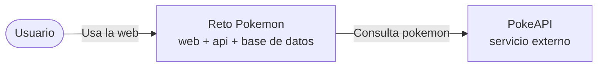
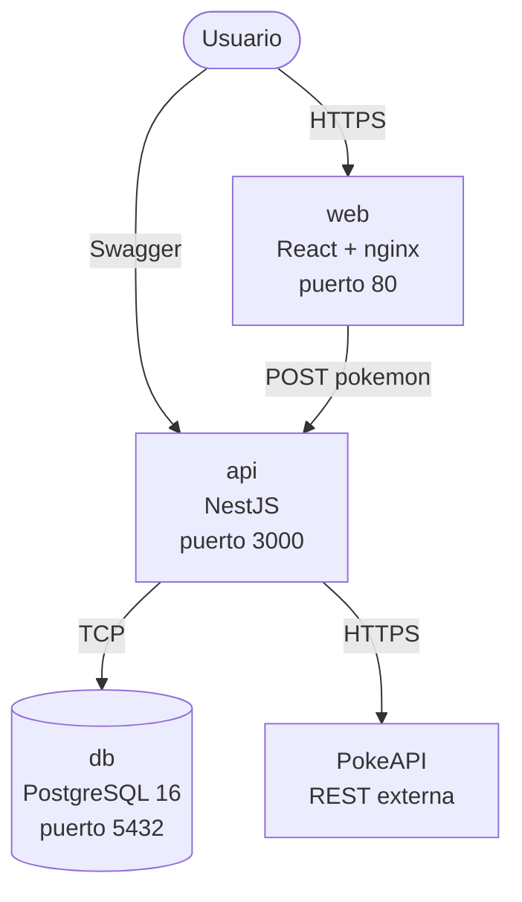
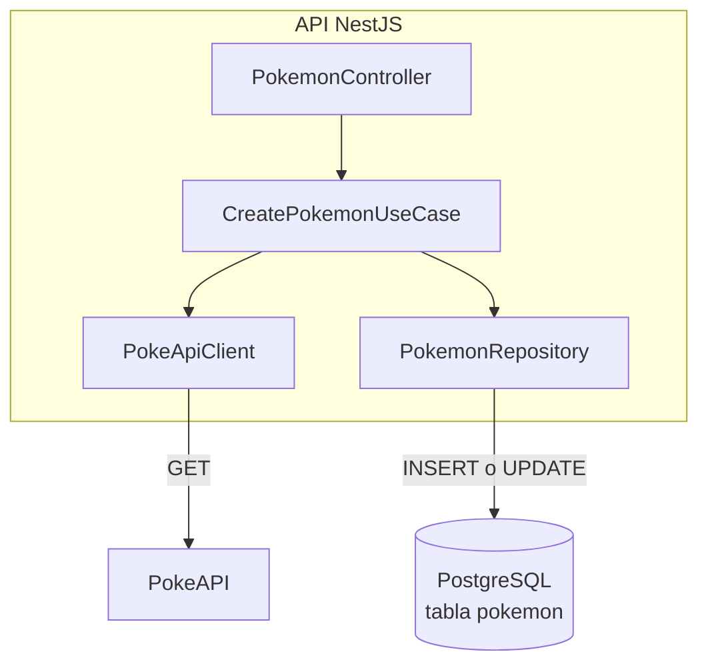
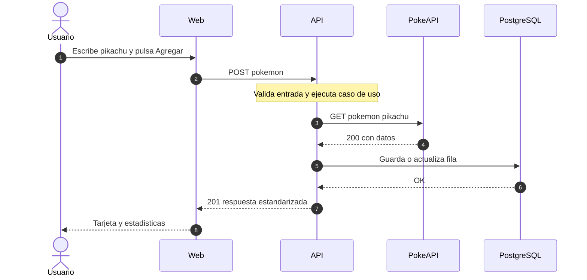
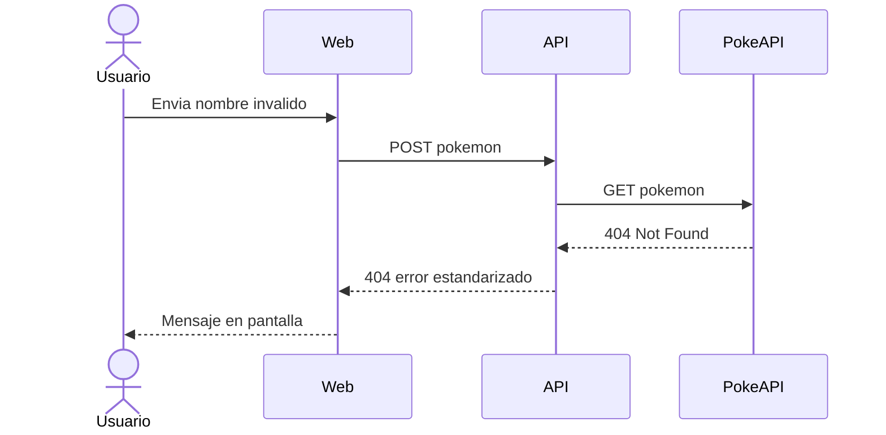
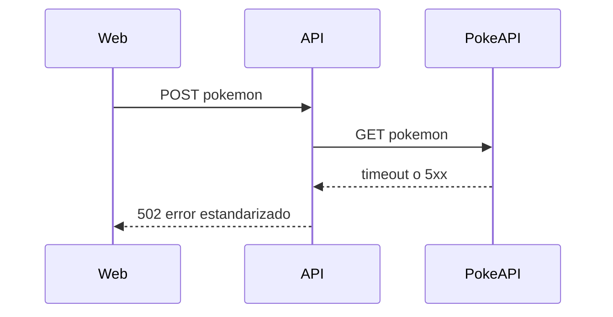
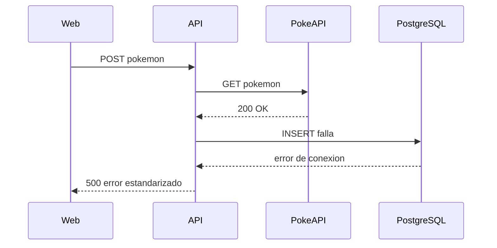
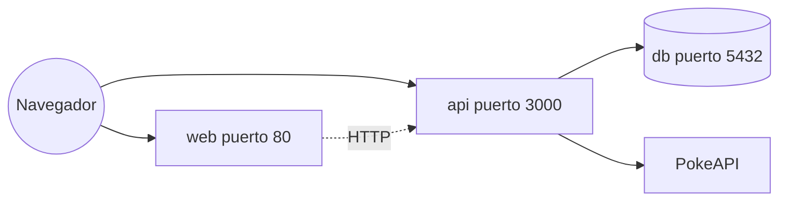

# C4 y flujos del sistema

Acá va la infra “dibujada”. Seguimos la lógica del modelo C4 (contexto, contenedores, componentes), pero los diagramas están en **flowchart** porque GitHub y varios visores todavía no renderizan bien `C4Context` / `C4Container`.

---

## Nivel 1: Contexto

La idea general: una persona usa el panel web, la aplicación llama a nuestra API, y la API es la que consulta PokeAPI y guarda en PostgreSQL.

En pocas palabras: **el navegador nunca llama a PokeAPI**. Lo hacemos a propósito, toda la integración externa queda en el backend.

---

## Nivel 2: Contenedores

Cuando levantás Docker Compose, en realidad tenés tres servicios y un sistema externo:

### Tabla de puertos (la que siempre se olvida)

| Servicio | Puerto en tu máquina | Imagen Docker |
|----------|------------------------|---------------|
| `web` | 80 | `apps/web` → nginx |
| `api` | 3000 | `apps/api` → Node 20 |
| `db` | 5432 | `postgres:16-alpine` |

**Orden de arranque:** primero `db` (espera a que Postgres responda), después `api`, y `web` al final. Si la API no está, la web igual carga pero falla al agregar. Obvio, pero pasa.

---

## Nivel 3: Componentes (solo la API)

La API está organizada en hexagonal ligera. No es magia: controlador → caso de uso → puertos (PokeAPI + repositorio).

Los filtros e interceptores (`HttpExceptionFilter`, `TransformInterceptor`) envuelven las respuestas HTTP; no los metí en el dibujo para no llenarlo de flechas.

---

## Diagrama de secuencia: camino feliz

Este es el flujo que importa para el reto: el usuario escribe “pikachu”, pulsa Agregar, y en algún momento el pokemon queda guardado.

Los pasos 4 al 6 suelen ir volando; si PokeAPI tarda, el usuario ve el indicador de carga en la web. Nada raro.

---

## Diagrama de secuencia: pokemon no existe

Cuando el nombre no está en PokeAPI, no guardamos nada en la BD (importante: **cero registros basura**).

---

## Diagrama de secuencia: PokeAPI caída

---

## Diagrama de secuencia: BD falla

---

## Despliegue con Docker (vista simplificada)

---

## Referencias

- [ADR-0001: Monorepo y Docker](/docs/adr/0001-monorepo-docker-compose.md)
- [ADR-0002: Backend](/docs/adr/0002-backend-monolito-modular-hexagonal.md)
- [Base de datos: ER y diccionario](/docs/infra/base-de-datos.md)
