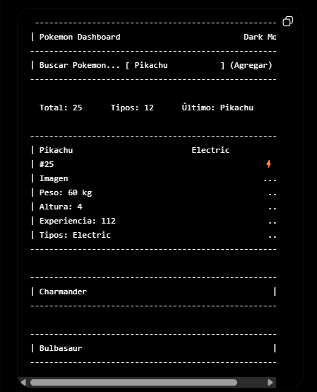
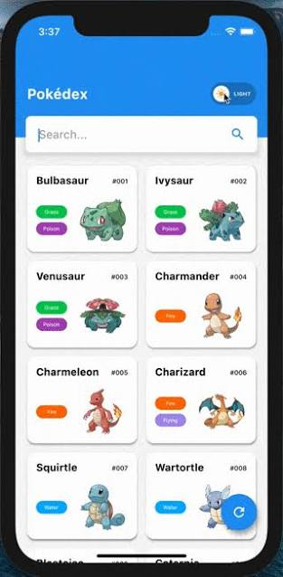
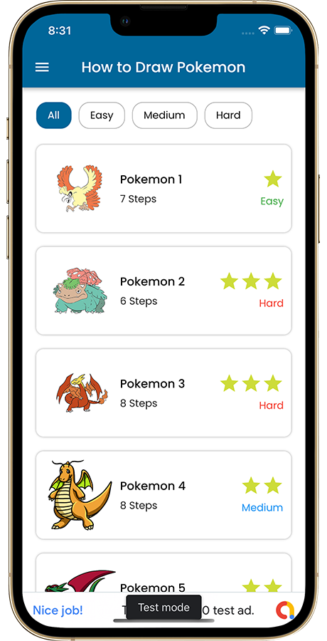
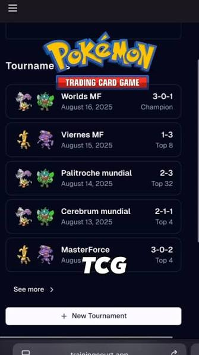
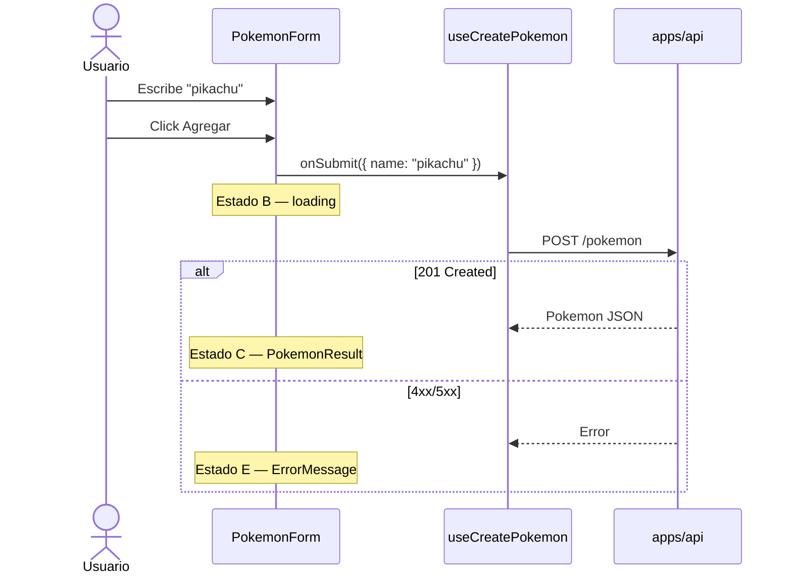

# Wireframes de referencia — Pokemon Dashboard

> Documentación de interfaz para `apps/web`.  
> Complementa [ADR-0003](/docs/adr/0003-frontend-react-feature-based-tanstack-query.md) y [openspec/specs/frontend/spec.md](/openspec/specs/frontend/spec.md).

## Propósito

Definir la **interfaz de referencia** del reto antes de implementar React. Los wireframes de este documento son la guía visual vinculante para layout, componentes y estados de UI.

**Wireframe canónico del proyecto:** adaptación del *Pokemon Dashboard* (imagen de referencia #1) al flujo del reto: buscar/agregar pokemon vía `POST /pokemon` y listar los persistidos.

---

## Imágenes de referencia (fuente visual)

Las siguientes capturas fueron provistas como inspiración. **No se copian literalmente**; se extraen patrones aplicables al reto.

### Ref-01 — Pokemon Dashboard (wireframe canónico)

**Archivo:** [`reference/01-pokemon-dashboard-wireframe.png`](./reference/01-pokemon-dashboard-wireframe.png)



**Patrones a adoptar:**

| Elemento | Uso en nuestro proyecto |
|----------|-------------------------|
| Barra de búsqueda + botón **Agregar** | Input nombre + CTA crear pokemon |
| Resumen superior (Total, Tipos, Último) | Stats del dashboard (`total`, tipos únicos, último creado) |
| Tarjeta expandida con detalle | `PokemonResult` tras crear o al seleccionar |
| Lista colapsada | Historial de pokemon guardados (v2 / opcional v1) |
| Dark mode | Tema por defecto de la UI |
| Campos: peso, altura, experiencia, tipos | Alineados a respuesta backend (`weight`, `height`, `baseExperience`, types si se añaden) |

**Este wireframe es la base del layout principal (`/`).**

---

### Ref-02 — Pokédex (grid + búsqueda)

**Archivo:** [`reference/02-pokedex-grid.png`](./reference/02-pokedex-grid.png)



**Patrones a tomar (inspiración secundaria):**

- Barra de búsqueda prominente con icono
- Cards en grid con ID, nombre y badges de tipo
- Toggle claro/oscuro (opcional v2; v1 puede ser solo dark)
- Jerarquía tipográfica: nombre bold + `#id` secundario

**No adoptar en v1:** grid 2 columnas mobile completo (el canónico es lista + detalle).

---

### Ref-03 — How to Draw Pokemon (lista + filtros)

**Archivo:** [`reference/03-how-to-draw-list.png`](./reference/03-how-to-draw-list.png)



**Patrones a tomar (inspiración secundaria):**

- Header con título claro
- Pills de filtro horizontal (futuro: filtrar por tipo)
- Filas tipo card: thumbnail + título + metadata
- Indicadores visuales de estado (equivalente a badges de error/éxito)

**No adoptar en v1:** categorías Easy/Medium/Hard (no aplican al reto).

---

### Ref-04 — Training Court (dark + lista + FAB)

**Archivo:** [`reference/04-trainingcourt-tournaments.png`](./reference/04-trainingcourt-tournaments.png)



**Patrones a tomar (inspiración secundaria):**

- Dark mode con cards bordeadas y buen contraste
- Lista vertical con metadata a la derecha (fecha ↔ stats)
- Botón primario fijo inferior **+ New …** → adaptar a **+ Agregar Pokemon**
- Tipografía: título bold + subtítulo muted

---

## Wireframe objetivo — Pantalla principal (`/`)

Basado en **Ref-01**, adaptado al contrato `POST /pokemon` (ADR-0002).

### Layout desktop / tablet (≥ 768px)

```
┌─────────────────────────────────────────────────────────────────────────┐
│  Pokemon Dashboard                                    [ Dark Mode ☑ ]   │
├─────────────────────────────────────────────────────────────────────────┤
│                                                                         │
│  ┌──────────────────────────────┐  ┌─────────────┐                      │
│  │ Buscar o ingresar nombre...  │  │  + Agregar  │                      │
│  └──────────────────────────────┘  └─────────────┘                      │
│                                                                         │
│  ┌─────────────┐  ┌─────────────┐  ┌──────────────────┐               │
│  │ Total: 25   │  │ Tipos: 12   │  │ Último: Pikachu  │               │
│  └─────────────┘  └─────────────┘  └──────────────────┘               │
│                                                                         │
│  ┌─ Detalle (expandido) ─────────────────────────────────────────────┐  │
│  │  Pikachu                                    Electric        ⚡    │  │
│  │  #25                                                              │  │
│  │  ┌────────────┐  Peso: 60 kg    Altura: 4                         │  │
│  │  │  [sprite]  │  Experiencia: 112                                 │  │
│  │  │   imagen   │  Guardado: 02/07/2026 17:00                       │  │
│  │  └────────────┘                                                   │  │
│  └───────────────────────────────────────────────────────────────────┘  │
│                                                                         │
│  ─ ─ ─ ─ ─ ─ ─ ─ ─ ─ ─ ─ ─ ─ ─ ─ ─ ─ ─ ─ ─ ─ ─ ─ ─ ─ ─ ─ ─ ─ ─ ─ ─   │
│  Charmander                                                             │
│  ─ ─ ─ ─ ─ ─ ─ ─ ─ ─ ─ ─ ─ ─ ─ ─ ─ ─ ─ ─ ─ ─ ─ ─ ─ ─ ─ ─ ─ ─ ─ ─ ─   │
│  Bulbasaur                                                              │
│                                                                         │
└─────────────────────────────────────────────────────────────────────────┘
```

### Layout mobile (< 768px)

```
┌─────────────────────────┐
│ ☰  Pokemon Dashboard    │
├─────────────────────────┤
│ [ Buscar pokemon...   ] │
│ [    + Agregar        ] │
├─────────────────────────┤
│ Total 25 │ Tipos 12    │
│ Último: Pikachu         │
├─────────────────────────┤
│ ┌─────────────────────┐ │
│ │ Pikachu      #25    │ │
│ │ [img]  Electric ⚡  │ │
│ │ Peso · Altura · Exp │ │
│ └─────────────────────┘ │
│ Charmander              │
│ Bulbasaur               │
├─────────────────────────┤
│      [ + Agregar ]      │  ← sticky bottom (patrón Ref-04)
└─────────────────────────┘
```

---

## Estados de UI (wireframes)

### Estado A — Inicial (idle)

```
[ Buscar pokemon...                    ] [ Agregar ]
Total: 0    Tipos: 0    Último: —

┌─────────────────────────────────────┐
│  Ingresa un nombre y pulsa Agregar  │
│  para consultar PokeAPI vía backend │
└─────────────────────────────────────┘
```

- Input vacío habilitado
- Botón **Agregar** habilitado
- Sin tarjeta de detalle
- Sin mensaje de error

**Componentes:** `CreatePokemonPage` → `PokemonForm` (dumb) + placeholder

---

### Estado B — Loading

```
[ pikachu                              ] [ Agregar ⟳ ]
Total: 0    Tipos: 0    Último: —

┌─────────────────────────────────────┐
│  ⟳  Buscando pokemon...             │
└─────────────────────────────────────┘
```

- Input deshabilitado
- Botón **Agregar** deshabilitado + spinner
- `aria-busy="true"` en región de resultado

**Componentes:** `PokemonForm` recibe `loading={true}`

---

### Estado C — Éxito

```
[                                      ] [ Agregar ]
Total: 26    Tipos: 12    Último: Pikachu

┌─ PokemonResult ─────────────────────┐
│ Pikachu              Electric  ⚡   │
│ #25                                 │
│ [sprite]  Peso: 60  Altura: 4       │
│           Exp: 112  Guardado: ahora │
└─────────────────────────────────────┘
```

- Input se limpia (o conserva valor — decisión: **limpiar**)
- Stats actualizados
- Tarjeta expandida con datos del `201 Created`

**Componentes:** `PokemonResult` (dumb) con props del backend

---

### Estado D — Error validación (cliente)

```
[                                      ] [ Agregar ]
⚠ El nombre del pokemon es requerido

┌─────────────────────────────────────┐
│  (sin tarjeta de detalle)           │
└─────────────────────────────────────┘
```

- Mensaje inline bajo input (`ErrorMessage` atom)
- Sin request al backend

---

### Estado E — Error API

| Código | Mensaje UI |
|--------|------------|
| 404 | Pokemon no encontrado. Verifica el nombre. |
| 502 | Servicio externo no disponible. Intenta más tarde. |
| 500 | Error al guardar. Intenta de nuevo. |

```
[ pikachu                              ] [ Agregar ]
┌─ ErrorMessage (aria-live) ──────────┐
│ ⚠ Pokemon no encontrado...          │
└─────────────────────────────────────┘
```

---

## Mapa componente → wireframe

| Zona wireframe | Componente (ADR-0003) | Tipo |
|----------------|----------------------|------|
| Header + dark toggle | `CreatePokemonPage` / layout | smart |
| Input + botón Agregar | `PokemonForm` | dumb |
| Stats (Total, Tipos, Último) | `PokemonStats` o inline en page | dumb |
| Tarjeta detalle | `PokemonResult` | dumb |
| Lista colapsada | `PokemonListItem` (v2) | dumb |
| Errores | `ErrorMessage` (`shared/ui`) | atom |
| Lógica POST | `useCreatePokemon` | hook |

---

## Tokens visuales (derivados de referencias)

| Token | Valor referencia | Notas |
|-------|------------------|-------|
| Fondo | `#0f1419` – `#1a1f2e` | Ref-01, Ref-04 dark |
| Superficie card | `#1e2530` + borde `#2d3748` | Cards Ref-04 |
| Texto primario | `#ffffff` | |
| Texto secundario | `#94a3b8` | Fechas, stats muted |
| Acento / CTA | `#ffffff` bg + texto oscuro, o `#3b82f6` | Botón Agregar |
| Error | `#ef4444` | Validación y API |
| Éxito | `#22c55e` | Badge opcional |
| Radio card | `12px` | Ref-02, Ref-04 |
| Espaciado base | `8px` grid | |

Implementación: **Tailwind CSS 4** (ADR-0003).

---

## Flujo de interacción



---

## Alcance por versión

| Elemento | v1 (reto mínimo) | v2 (opcional) |
|----------|------------------|---------------|
| Buscar + Agregar | ✅ | |
| Stats dashboard | ✅ (calculados en cliente o GET) | |
| Tarjeta detalle post-create | ✅ | |
| Lista histórica colapsada | ❌ | ✅ con `GET /pokemon` |
| Grid estilo Pokédex | ❌ | ✅ |
| Filtros por tipo | ❌ | ✅ |
| FAB móvil sticky | ✅ recomendado | |
| Toggle light/dark | ❌ (solo dark v1) | ✅ |

---

## Criterios de aceptación UI

- [ ] Layout sigue wireframe **Ref-01** (header, search, agregar, stats, detalle).
- [ ] Estados A–E implementados según sección *Estados de UI*.
- [ ] Imágenes de referencia enlazadas en este doc bajo `docs/ui/reference/`.
- [ ] Componentes dumb sin lógica de API (`PokemonForm`, `PokemonResult`).
- [ ] Responsive: layout mobile con botón sticky (patrón **Ref-04**).
- [ ] Accesibilidad: labels en input, `aria-live` en errores, submit deshabilitado en loading.

---

## Referencias cruzadas

- [ADR-0003 — Frontend](/docs/adr/0003-frontend-react-feature-based-tanstack-query.md)
- [OpenSpec frontend](/openspec/specs/frontend/spec.md)
- [reto.md — US-14 a US-17](/docs/requirements/reto.md)
