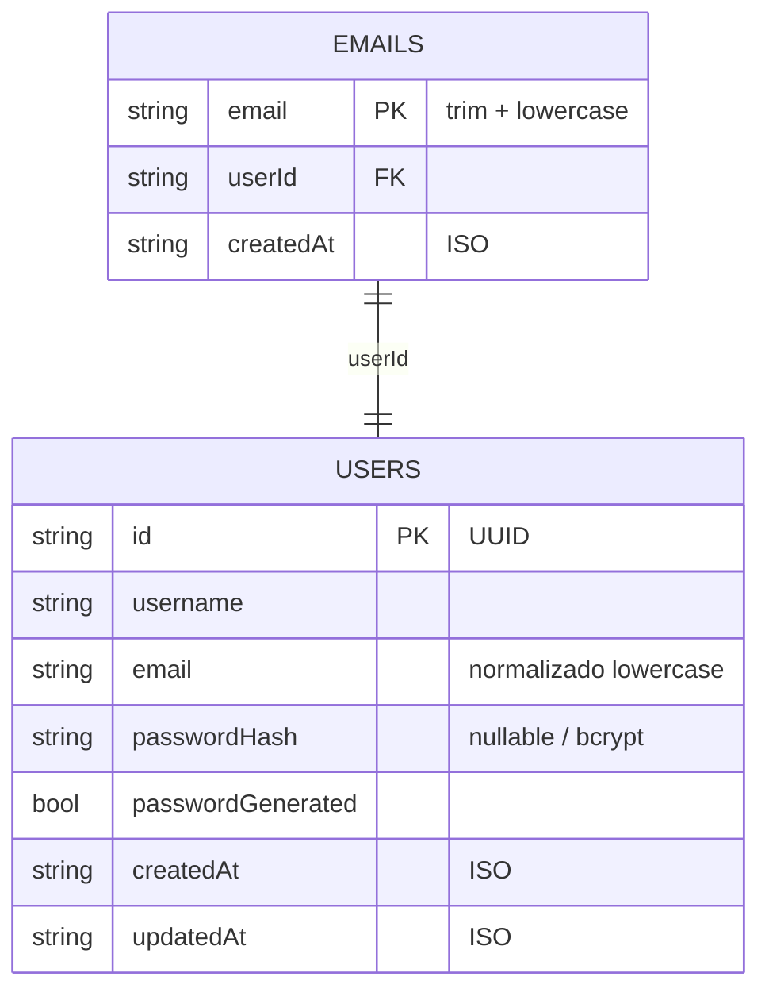

# Base de datos — Firestore

Persistencia vía **Firebase Admin SDK** contra Firestore (emulator en demo). No hay PostgreSQL ni TypeORM en este reto.

## Colecciones

### `users/{userId}`

Documento del agregado User.

| Campo | Tipo | Descripción |
|-------|------|-------------|
| (doc id) | string | UUID generado en application |
| `username` | string | Trim |
| `email` | string | Trim + lowercase |
| `passwordHash` | string \| null | Solo bcrypt; nunca plaintext |
| `passwordGenerated` | boolean | `true` si el sistema generó el password |
| `createdAt` / `updatedAt` | string | ISO-8601 |

### `emails/{normalizedEmail}`

Claim de unicidad. Se escribe **en la misma transacción** que el user en create. Si el email ya existe → conflicto (HTTP 409).

| Campo | Tipo | Descripción |
|-------|------|-------------|
| (doc id) | string | Email normalizado |
| `userId` | string | Id del user dueño |
| `createdAt` | string | ISO-8601 |

Al borrar un user (compensate tras fallo de finalize), se eliminan el doc de `users` y su claim en `emails`.

## Acceso desde la app

- Port: `UserRepositoryPort`
- Adapter: `apps/api/src/modules/users/infrastructure/persistence/firestore-user.repository.ts`
- Domain: sin imports de `firebase-admin`

## Emulator

Ver README raíz. Proyecto lógico tipicamente `demo-users` + `FIRESTORE_EMULATOR_HOST=127.0.0.1:8080`.
