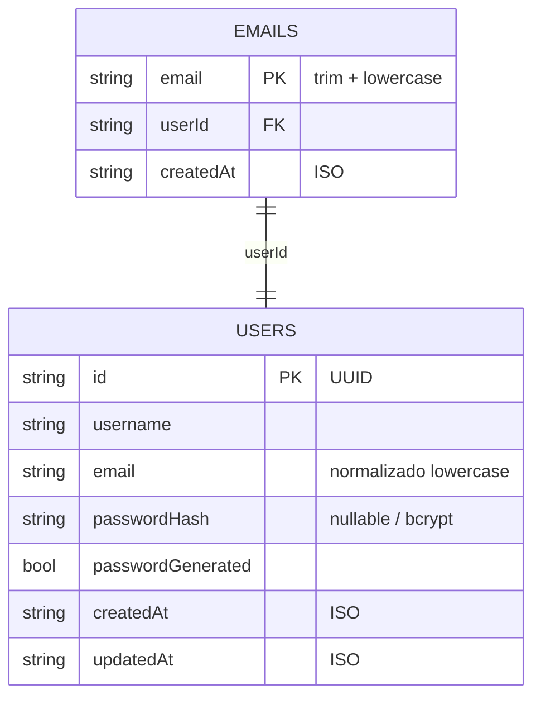

# Base de datos — Firestore

Guardamos usuarios con el **Admin SDK** de Firebase contra Firestore. En la demo, el emulador.  
No hay Postgres ni TypeORM en este reto.

## Colecciones

### `users/{userId}`

El documento del usuario.

| Campo | Tipo | Notas |
|-------|------|--------|
| (id del doc) | string | UUID que arma la aplicación |
| `username` | string | Con trim |
| `email` | string | Trim + minúsculas |
| `passwordHash` | string \| null | Solo bcrypt; nunca el texto plano |
| `passwordGenerated` | boolean | `true` si lo generó el sistema |
| `createdAt` / `updatedAt` | string | ISO-8601 |

### `emails/{emailNormalizado}`

Es el **claim** de unicidad: se escribe **en la misma transacción** que el user al crear.  
Si el email ya está → conflicto → HTTP **409**.

| Campo | Tipo | Notas |
|-------|------|--------|
| (id del doc) | string | Email normalizado |
| `userId` | string | Dueño del claim |
| `createdAt` | string | ISO-8601 |

Si falla el finalize del password y compensamos, borramos el user **y** su claim.

## Desde la app

- Puerto: `UserRepositoryPort`
- Adaptador: `apps/api/src/modules/users/infrastructure/persistence/firestore-user.repository.ts`
- El dominio **no** importa `firebase-admin`

## Emulator

Ver el README raíz. Proyecto típico de demo: `demo-reto-geekscastle` con  
`FIRESTORE_EMULATOR_HOST=127.0.0.1:8080`.

Más contexto: [ADR-0003](../adr/0003-firebase-firestore-emulator.md) · [wiki arquitectura](../wiki/arquitectura.md).
