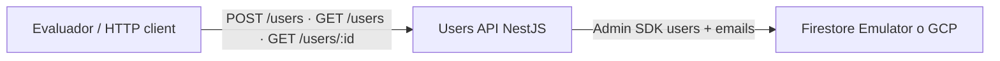
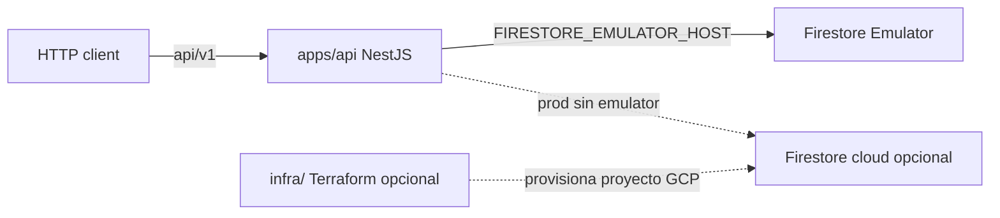
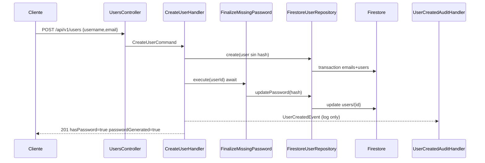
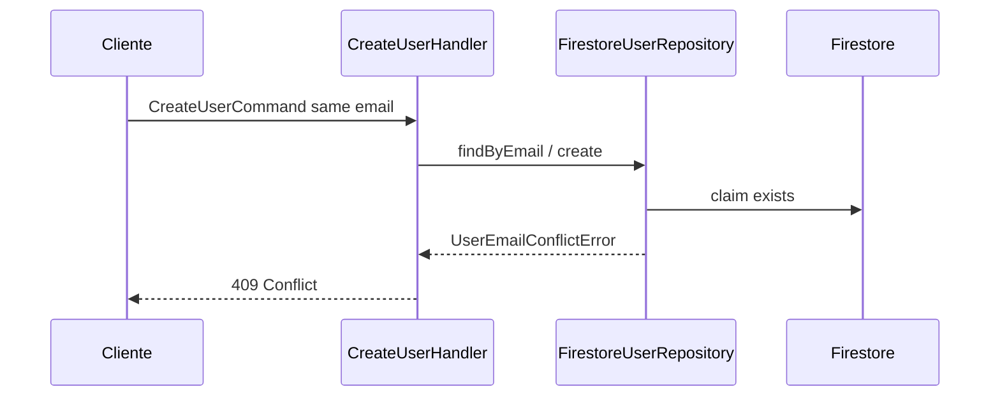

# C4 y flujos — Users API

## Contexto (C4 L1)

Resumen: cliente → Nest API → Firestore.

## Contenedores (C4 L2)

No hay frontend web ni Postgres en el alcance del challenge. Terraform no configura el emulator local.

## Componentes (módulo users)

| Capa | Piezas |
|------|--------|
| HTTP | `UsersController`, DTO, throttle global (health `@SkipThrottle`) |
| Application | `CreateUserHandler`, `ListUsersHandler`, `GetUserByIdHandler`, `FinalizeMissingPasswordService`, `UserCreatedAuditHandler` |
| Domain | `User`, ports, `UserCreatedEvent`, errors |
| Infrastructure | Firestore repo, bcrypt hasher, crypto password generator, Firebase provider |

## Secuencia: create sin password

## Secuencia: email duplicado

## Referencias

- [Base de datos](./base-de-datos.md)
- [ADR-0002](../adr/0002-backend-hexagonal-cqrs.md) — await finalize + evento señal
- [ADR-0003](../adr/0003-firebase-firestore-emulator.md)
- [Terraform lite](../../infra/README.md)
