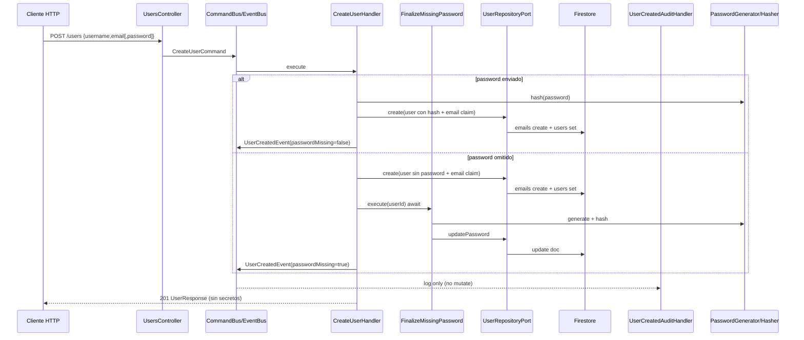

# Reto técnico — Users API (NestJS + Firebase)

> **Fuente de verdad (OpenSpec):** `openspec/specs/` (cuando exista el change aplicado)  
> Este archivo es el **índice de historias de usuario** listo para GitHub Issues / Projects.  
> Los requisitos testeables viven en los specs por dominio. Las decisiones de *cómo* están en `docs/adr/`.

**Objetivo:** API backend en **NestJS + TypeScript** con **arquitectura hexagonal + CQRS**, persistencia en **Firebase (Firestore via Admin SDK)**, que permita crear un `User` y, si falta `password`, lo genere de forma segura, lo hashee y **actualice** el registro **antes** de responder 201 (`FinalizeMissingPasswordService`, await). Tras el insert/finalize se publica **`UserCreatedEvent`** como señal de dominio/audit — el `@EventsHandler` **no** vuelve a mutar password (ver ADR-0002).

**PDF challenge:** `Challenge -Desarrollador Backend 2026.pdf`  
**Deadline entrega:** antes del **jueves 16 de julio 2026, 12:00 CDMX**.

**Contexto de postulación (complemento):** además del PDF (NestJS / TypeScript / Firebase / Clean Architecture), en el proceso se pidió experiencia en **Nx** y **Terraform**. Se incorporan en modo *lite* (ADR-0006, ADR-0007) sin desviar el núcleo del challenge.

**Stack acordado (equipo + proceso):**

| Área | Decisión |
|------|----------|
| Lenguaje / framework | TypeScript + NestJS |
| Workspace | **Nx lite** — app `apps/api` |
| Arquitectura | Hexagonal (ports/adapters) + Clean Architecture |
| Aplicación | **CQRS** — command/query y handler en **archivos independientes** |
| Persistencia | Firebase Firestore (Admin SDK) + emulador local |
| IaC | **Terraform lite** en `infra/` (plan/validate; apply cloud no obligatorio) |
| Tests | Jest ≥ **80 %** statements (umbral CI) |
| CI | GitHub Actions: compile (`build`) + tests (`test:cov`) |
| Auth HTTP | Fuera de alcance v1 del reto (demo); ver ADR de seguridad |

---

## Mapa de historias → OpenSpec (previsto)

| ID | Historia (resumen) | Spec previsto | Epic |
|----|-------------------|---------------|------|
| **US-01** | Bootstrap NestJS + TypeScript strict | `platform` | Plataforma |
| **US-02** | Estructura hexagonal por módulo `users` | `platform` | Plataforma |
| **US-03** | CQRS: command/query + handler por archivo | `platform` | Plataforma |
| **US-04** | Config/env validada (Firebase, puerto) | `platform` | Plataforma |
| **US-05** | Entidad de dominio `User` | `users` | Usuarios |
| **US-06** | Port `UserRepositoryPort` | `users` | Usuarios |
| **US-07** | Adapter Firestore `UserRepository` | `users` | Usuarios |
| **US-08** | Port `PasswordGeneratorPort` / hasher | `users` | Usuarios |
| **US-09** | `POST /users` crear usuario | `users` | Usuarios |
| **US-10** | Password opcional en create | `users` | Usuarios |
| **US-11** | Evento al insertar si no hay password | `users` | Usuarios |
| **US-12** | Generar password seguro + actualizar Firestore | `users` | Usuarios |
| **US-13** | Hashear password (nunca plaintext en DB) | `users` | Usuarios |
| **US-14** | Errores de validación / persistencia / dominio | `users` | Usuarios |
| **US-15** | Query leer usuario por id (sin password) | `users` | Usuarios |
| *(extra)* | `GET /users` listar (sin secretos; vacío = `[]`) | `users` | Usuarios |
| **US-16** | Tests Jest ≥ 80 % + casos clave password/evento | `testing` | Calidad |
| **US-17** | Firebase Emulator en desarrollo local | `delivery` | Entrega |
| **US-18** | README: setup, run, tests, curl | `delivery` | Entrega |
| **US-19** | CI GitHub Actions (build + test:cov) | `delivery` | Entrega |
| **US-20** | Documentación ADR + OpenSpec | `delivery` | Entrega |
| **US-21** | Nx workspace lite (`apps/api`) | `delivery` | Entrega |
| **US-22** | Terraform lite Firebase (`infra/`) | `delivery` | Entrega |

---

## Historias de usuario (formato ágil detalle)

Cada historia está pensada para **un Issue de GitHub**.  
Etiquetas sugeridas: `epic:<nombre>`, `type:story`, `layer:domain|application|infra|delivery`, `priority:p0|p1`.

Convención de estados en Project (recomendado):

`Backlog` → `Ready` → `In Progress` → `In Review` → `Done`

---

### Epic: Plataforma y arquitectura

#### US-01 — Bootstrap NestJS + TypeScript

**Como** desarrollador / evaluador,  
**quiero** un proyecto NestJS con TypeScript en modo `strict`,  
**para** cumplir el stack del reto y tipado seguro.

**Criterios de aceptación**

- [x] Proyecto NestJS ejecutable (`npm run start:dev` o equivalente).
- [x] `tsconfig` con `strict: true` (o flags equivalentes del template Nest actual).
- [x] Prefijo global de API documentado (ej. `/api/v1`).
- [x] Endpoint `GET /health` (o `/api/v1/health`) responde `200`.
- [x] `.env.example` sin secretos reales; `.env` en `.gitignore`.

**Notas técnicas:** ver ADR-0001 (bootstrap / estructura repo).  
**Estimación sugerida:** S

---

#### US-02 — Estructura hexagonal del módulo `users`

**Como** arquitecto,  
**quiero** el módulo `users` separado en `domain` / `application` / `infrastructure` / presentación HTTP,  
**para** cumplir Clean Architecture y que Firebase no filtre al dominio.

**Criterios de aceptación**

- [x] Capas presentes y dependencia hacia adentro (domain sin Nest/Firebase).
- [x] Controllers delgados: validan DTO y despachan command/query.
- [x] Infraestructura implementa ports; no hay lógica de negocio en repository.
- [x] Estructura documentada en ADR-0002 y en README o guía.

**Estimación sugerida:** M

---

#### US-03 — CQRS con archivos independientes

**Como** desarrollador,  
**quiero** cada comando/query y su handler en archivos separados,  
**para** mantener una funcionalidad = un flow CQRS trazable y testeable.

**Criterios de aceptación**

- [x] `CreateUserCommand` en archivo propio.
- [x] `CreateUserHandler` en archivo propio.
- [x] Si existe lectura: `GetUserByIdQuery` + `GetUserByIdHandler` en archivos propios.
- [x] Handlers registrados vía `@nestjs/cqrs` (`CqrsModule` / providers del módulo).
- [x] Un handler orquesta; no contiene acceso directo a Admin SDK (usa ports).

**Estimación sugerida:** S  
**Depends on:** US-02

---

#### US-04 — Configuración y validación de entorno

**Como** operador local,  
**quiero** que la app falle en bootstrap si faltan variables Firebase/puerto,  
**para** no arrancar en estado inconsistente.

**Criterios de aceptación**

- [x] `ConfigModule` (o equivalente) + schema de env validado.
- [x] Variables documentadas: al menos `PORT`, flags/credenciales Firebase o `FIREBASE_AUTH_EMULATOR_HOST` / project id según ADR-0003.
- [x] Sin `process.env` disperso en domain/application.

**Estimación sugerida:** S

---

### Epic: Usuarios — dominio e infraestructura

#### US-05 — Entidad de dominio `User`

**Como** sistema,  
**quiero** modelar `User` con `id`, `username`, `email`, `password` (opcional en creación),  
**para** expresar las reglas del reto en el dominio.

**Criterios de aceptación**

- [x] Campos del reto: `id` (generado), `username`, `email`, `password` opcional al crear.
- [x] `id` no lo inventa el cliente (o se ignora si viene).
- [x] Invariantes mínimas: username/email no vacíos; email con formato válido en frontera HTTP y/o dominio.
- [x] El dominio no expone detalle de Firestore.

**Estimación sugerida:** S

---

#### US-06 — Port de repositorio de usuarios

**Como** capa de aplicación,  
**quiero** un `UserRepositoryPort` (interface + token de inyección),  
**para** persistir/leer sin acoplarme a Firebase.

**Criterios de aceptación**

- [x] Métodos mínimos: `create`, `updatePassword`, `findById` (más `findByEmail`, `list`, `delete` según evolución).
- [x] Token de DI documentado (ej. `USER_REPOSITORY_PORT`).
- [x] Application/handlers solo dependen del port.

**Estimación sugerida:** S  
**Depends on:** US-05

---

#### US-07 — Adapter Firestore (Firebase Admin SDK)

**Como** sistema,  
**quiero** un adapter que implemente el port contra Firestore,  
**para** cumplir el requisito de base de datos Firebase del reto.

**Criterios de aceptación**

- [x] Usa Firebase Admin SDK (no SDK de cliente en Nest).
- [x] Colección documentada (ej. `users`).
- [x] Mapeo documento ↔ dominio explícito.
- [x] Funciona contra **Firebase Emulator** en local (ADR-0003).
- [x] Errores de persistencia se traducen a error de dominio/aplicación tipado.

**Estimación sugerida:** M  
**Depends on:** US-06, US-04

---

#### US-08 — Ports de generación y hashing de password

**Como** sistema de seguridad,  
**quiero** abstraer generación de password seguro y hashing,  
**para** testear handlers sin cryptography real y poder cambiar librería.

**Criterios de aceptación**

- [x] Port(s) p.ej. `PasswordGeneratorPort`, `PasswordHasherPort` (o uno compuesto si se justifica en ADR).
- [x] Generación usa fuente criptográficamente segura (stdio `crypto` o lib acordada).
- [x] Hashing con **bcrypt** (o equivalente documentado); **nunca** guardar plaintext.
- [x] Longitud/complejidad mínima del password generado definida en ADR-0005.

**Estimación sugerida:** S

---

### Epic: Usuarios — commands, evento y API

#### US-09 — `POST /users` crear usuario

**Como** cliente API,  
**quiero** `POST /users` con `username` y `email` (y `password` opcional),  
**para** registrar un usuario en Firebase.

**Criterios de aceptación**

- [x] DTO validado (`class-validator` o Zod según ADR) con `whitelist` + `forbidNonWhitelisted`.
- [x] Controller dispara `CreateUserCommand` (no llama Firestore directo).
- [x] Respuesta éxito `201 Created` con usuario creado.
- [x] La respuesta **no** incluye password en plaintext (ni hash, salvo decisión explícita de excluir ambos — recomendado excluir ambos).
- [x] Documentado en README (ejemplo curl).

**Contrato propuesto**

```http
POST /api/v1/users
Content-Type: application/json

{
  "username": "jane",
  "email": "jane@example.com",
  "password": "OpcionalSiElClienteYaTieneUno"
}
```

```json
// 201 Created (ejemplo)
{
  "id": "auto-generated-id",
  "username": "jane",
  "email": "jane@example.com",
  "passwordGenerated": true
}
```

**Estimación sugerida:** M  
**Depends on:** US-03, US-07

---

#### US-10 — Password opcional al crear

**Como** cliente,  
**quiero** omitir `password` en el body,  
**para** que el sistema lo genere de forma segura tras el insert.

**Criterios de aceptación**

- [x] Create válido sin campo `password`.
- [x] Create válido con `password` (si se proporciona): se hashea y persiste; **no** se regenera después.
- [x] Regla documentada: si falta password, finalize (await) genera/hashea/actualiza; el evento es señal/audit, no el mutador (ADR-0002).

**Estimación sugerida:** S  
**Depends on:** US-09

---

#### US-11 — Evento de dominio al insertar usuario

**Como** sistema,  
**quiero** que al insertar un nuevo usuario se dispare un evento de dominio,  
**para** cumplir el requisito del reto de “evento al insertar”.

**Criterios de aceptación**

- [x] Tras persistir el usuario (y finalize de password si aplica), se publica un evento (`UserCreatedEvent`) — archivo propio.
- [x] Handler del evento en archivo propio (`UserCreatedAuditHandler`) — **solo audit/log**; no muta password.
- [x] El evento carga al menos `userId` y señal de si faltaba password.
- [x] El flujo es testeable con EventBus mockeado o unit del handler de audit.

**Nota de diseño (vinculante en ADR-0002):** Nest `EventBus.publish` **no espera** `@EventsHandler`. La generación/hash/update del password cuando falta corre en `FinalizeMissingPasswordService` (await desde el command). El evento es señal de dominio; el handler de evento no es el mutador. No se usa Cloud Function como única solución.

**Estimación sugerida:** M  
**Depends on:** US-09, US-10

---

#### US-12 — Generar password seguro y actualizar registro

**Como** sistema,  
**quiero** que el path de finalize en application genere un password seguro y actualice el usuario en Firebase,  
**para** completar el registro cuando el cliente no envió password (con respuesta HTTP consistente).

**Criterios de aceptación**

- [x] Si `password` ya existía / ya hay hash: finalize no-op (idempotente / early return).
- [x] Si faltaba: genera → hashea → `repository.updatePassword` en Firestore (await antes del 201).
- [x] Password generado cumple política (longitud, charset) del ADR-0005.
- [x] Caso cubierto por test unitario de `FinalizeMissingPasswordService` (ports mockeados) + smoke.

**Estimación sugerida:** M  
**Depends on:** US-08, US-11

---

#### US-13 — Nunca persistir password en plaintext

**Como** responsable de seguridad,  
**quiero** que Firestore guarde solo el hash,  
**para** reducir impacto de fuga de datos.

**Criterios de aceptación**

- [x] Campo persistido es hash (bcrypt), no el string generado/raw del cliente.
- [x] Logs no imprimen password ni hash.
- [x] Respuestas HTTP no incluyen password/hash.

**Estimación sugerida:** S  
**Depends on:** US-08, US-12

---

#### US-14 — Manejo de errores

**Como** cliente API,  
**quiero** errores HTTP claros y consistentes,  
**para** distinguir validación, conflicto y fallo de Firebase.

**Criterios de aceptación**

| Caso | HTTP sugerido |
|------|----------------|
| Body inválido (email mal formado, campos faltantes, extras) | `400` |
| Email/username duplicado (si se implementa unicidad) | `409` |
| Usuario no encontrado en GET | `404` |
| Firebase/emulator no disponible o error de escritura | `502` o `500` (definir en ADR y mapear en filter) |
| Error interno no clasificado | `500` sin stack trace al cliente |

- [x] Errores de dominio tipados; filter global mapea a HTTP.
- [x] Tests de al menos validación `400` y un fallo de persistencia mockeado.

**Estimación sugerida:** M

---

#### US-15 — Query: obtener usuario por id

**Como** cliente / evaluador,  
**quiero** `GET /users/:id` (sin secretos),  
**para** verificar que el usuario quedó persistido (y si se generó password via flag).

**Criterios de aceptación**

- [x] `GetUserByIdQuery` + handler en archivos independientes.
- [x] `200` con datos públicos; `404` si no existe.
- [x] No expone password/hash.
- [x] Campo opcional `hasPassword: boolean` o `passwordGenerated` si aporta verificación del flujo del reto.

**Estimación sugerida:** S  
**Depends on:** US-07, US-03

> **Extra (no US formal):** también existe `GET /api/v1/users` (listar). Devuelve `200` + array público; si no hay usuarios, `[]` (no 404). Ver OpenSpec `users` → List users query.

---

### Epic: Calidad, emulador, entrega

#### US-16 — Tests Jest ≥ 80 %

**Como** evaluador,  
**quiero** pruebas unitarias con cobertura global ≥ 80 % (statements) y umbral en Jest,  
**para** cumplir el criterio de calidad del equipo y del CI.

**Criterios de aceptación**

- [x] `npm run test` y `npm run test:cov` documentados.
- [x] `coverageThreshold.global.statements: 80` (y branches/functions/lines razonables).
- [x] Specs prioritarios:
  - Handler `CreateUser`
  - `FinalizeMissingPasswordService` + handler de audit del evento (no muta password)
  - Generador / hasher (o adapter)
  - Controller (delegación)
  - Repository adapter (mock Admin SDK / Firestore)
- [x] Convención de nombres: `should <behavior> when <condition>`.
- [x] Casos clave del reto: create sin password → finalize → update + evento audit; create con password → no regenera.

**Estimación sugerida:** L  
**Depends on:** US-09–US-13

---

#### US-17 — Firebase Emulator para desarrollo

**Como** desarrollador,  
**quiero** correr Firestore Emulator localmente,  
**para** desarrollar y demo sin proyecto cloud de pago.

**Criterios de aceptación**

- [x] Instrucciones: `firebase init` / emulators + `firebase emulators:start` (o script npm).
- [x] Nest apunta al emulator vía env (ADR-0003).
- [x] No se requieren credenciales de producción para el happy path local.

**Estimación sugerida:** M

---

#### US-18 — README de configuración y ejecución

**Como** evaluador,  
**quiero** documentación básica de setup y ejecución,  
**para** clonar y probar sin conocimiento previo del repo.

**Criterios de aceptación**

- [x] Prerrequisitos (Node versión, Firebase CLI).
- [x] Cómo configurar `.env` desde `.env.example`.
- [x] Cómo levantar emulator + API.
- [x] Cómo correr tests.
- [x] Ejemplo `curl` de `POST /users` con y sin password.
- [x] Enlaces a `docs/requirements/reto.md` y ADRs.

**Estimación sugerida:** S

---

#### US-19 — CI con GitHub Actions

**Como** equipo,  
**quiero** un workflow que en push/PR compile y ejecute tests con umbral,  
**para** no mergear código que no construye o baja de 80 %.

**Criterios de aceptación**

- [x] Archivo `.github/workflows/ci.yml`.
- [x] Jobs: install → build → `test:cov` (Node LTS acordada).
- [x] Falla el pipeline si coverage < 80 % o build falla.
- [x] Documentado en ADR-0004 y README.
- [x] CD / deploy cloud **fuera de alcance** v1.

**Estimación sugerida:** S

---

#### US-20 — ADRs + OpenSpec como documentación viva

**Como** equipo,  
**quiero** ADRs y specs OpenSpec mantenidos,  
**para** que historias GitHub, implementación y criterios de aceptación no diverjan.

**Criterios de aceptación**

- [x] ADRs 0001–0007 aceptados en `docs/adr/`.
- [x] OpenSpec inicializado; change inicial propuesto/aplicado según flujo `/opsx`.
- [x] Mapa US → spec actualizado cuando cambien requisitos.

**Estimación sugerida:** M

---

#### US-21 — Nx workspace lite

**Como** evaluador del proceso (señal Nx),  
**quiero** un workspace Nx con la API Nest en `apps/api`,  
**para** ver orquestación Nx sin monorepo especulativo multi-app.

**Criterios de aceptación**

- [x] Existen `nx.json` y proyecto `api` bajo `apps/api`.
- [x] Comandos documentados: serve / build / test (vía Nx o wrappers npm).
- [x] CI construye y testea el proyecto `api` (ADR-0004 + ADR-0006).
- [x] Sin apps frontend ni libs inventadas “por si acaso”.

**Estimación sugerida:** M  
**Prioridad vs deadline:** P1 — no bloquea el core User si el tiempo aprieta; preferible dejarlo hecho.

---

#### US-22 — Terraform lite para Firebase

**Como** evaluador del proceso (señal Terraform),  
**quiero** IaC bajo `infra/` que describe el aprovisionamiento Firebase/GCP,  
**para** evidenciar criterio IaC sin exigir cloud real para la demo.

**Criterios de aceptación**

- [x] Carpeta `infra/` con Terraform (`fmt` + `validate` documentados).
- [x] Recursos acotados (APIs / Firestore parametrizados); sin landing zone gigante.
- [x] Sin secretos ni state sensible en git.
- [x] README distingue: runtime challenge = emulator; cloud = `terraform plan`.

**Estimación sugerida:** M  
**Prioridad vs deadline:** P1 — complementary; demoran menos que el flujo CQRS+tests.

---

## Flujo de negocio (secuencia)



---

## Criterios de evaluación (reto + equipo)

| Criterio | Origen | Umbral |
|----------|--------|--------|
| Clean Architecture / hexagonal | Reto | Capas separadas, domain limpio |
| Inserción User + evento + password | Reto | Flujo US-09…US-13 |
| Firebase correcto | Reto | Admin SDK + emulator local |
| Documentación | Reto | README + este doc + ADRs |
| Tests unitarios clave | Reto + equipo | Password + update; Jest ≥ **80 %** |
| CQRS archivos independientes | Equipo | US-03 |
| CI compile + tests | Equipo | US-19 |
| Nx lite | Proceso / equipo | US-21 |
| Terraform lite | Proceso / equipo | US-22 |
| Entrega a tiempo | Proceso | Antes 2026-07-16 12:00 CDMX |

---

## Cómo usar con OpenSpec + GitHub

```bash
# OpenSpec
npx openspec init --tools cursor
# /opsx:propose bootstrap-users-api   # en Cursor
# /opsx:apply …
# /opsx:archive …

# GitHub Issues (cuando exista remote + gh autenticado)
gh issue create --title "US-09: POST /users crear usuario" --body-file ...
gh project item-add <project-number> --owner <org-or-user> --url <issue-url>
```

**Complemento:** `docs/adr/` define el *cómo*. Este archivo define el *qué* y las US listables.

---

## Fuera de alcance (v1)

- Frontend / UI
- Autenticación JWT/OAuth de clientes API
- Firebase Authentication como Identity Provider (solo Firestore como DB salvo que un ADR lo habilite explícitamente)
- Cloud Functions como reemplazo del evento Nest
- CD / `terraform apply` automático a producción
- Nx con muchas libs / module boundary estricto
- Unicidad email/username *es deseable* pero solo obligatoria si se implementa en US-14 como `409`

---

## Glosario

| Término | Significado |
|---------|-------------|
| Command | Intención de escribir estado |
| Query | Lectura sin side-effects |
| Handler | Ejecutor de un command/query/event (archivo propio) |
| Port | Contrato en domain/application |
| Adapter | Implementación infra (Firestore, bcrypt, HTTP) |
| Password generado | Valor aleatorio seguro **antes** de hashear; solo existe en memoria el tiempo necesario para hashear |
